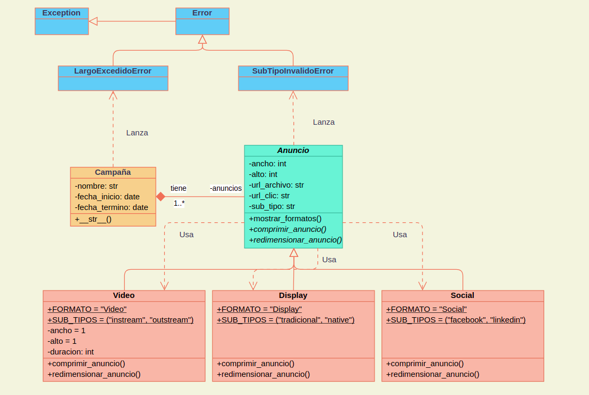

# Implementación de API para Gestión de Campañas Publicitarias

Este proyecto consiste en la creación de una API que implementa la lógica "BackEnd" de una plataforma web de una empresa de marketing digital. La API permitirá gestionar campañas publicitarias en diversas plataformas de anuncios digitales.

## Descripción

La API permite la gestión de campañas publicitarias, incluyendo la creación de campañas y la administración de anuncios dentro de cada campaña. Actualmente, se encuentra en una etapa inicial de desarrollo, donde se han definido las clases básicas y las reglas de negocio para instanciar campañas y anuncios.

## Requerimientos

### 1. Creación de clases y atributos estáticos

- En el archivo `campaña.py`, se define la clase `Campaña` para crear instancias de campañas.
- En el archivo `anuncio.py`, se define la clase `Anuncio` y las clases `Video`, `Display` y `Social` para crear instancias de diferentes tipos de anuncios.
- En el archivo `error.py`, se definen las clases de excepciones necesarias según el diagrama de clases.

### 2. Sobrecarga de funciones especiales

- Se sobrecarga la función especial `__init__` en las clases requeridas para asignar los valores recibidos por parámetro a los atributos correspondientes.
- Se sobrecarga la función especial `__str__` en la clase `Campaña` para mostrar información sobre la campaña.

### 3. Implementación de especificación técnica en programación orientada a objeto

- Se aplica herencia en clases correspondientes, incluyendo llamado a clase padre en constructor.
- Se definen métodos abstractos y se implementan sus sobreescrituras en las clases indicadas en el diagrama de clases.
- Se definen propiedades con getter y setter para los atributos de instancia privados, aplicando las reglas solicitadas.

### 4. Uso de colaboración y composición

- Se aplica composición para crear componentes según la información entregada en el diagrama de clases.
- Se aplica colaboración entre las clases adecuadas para crear un método que muestra en pantalla los formatos y subtipos disponibles para cada tipo de anuncio.

### 5. Flujos de excepción y escritura de archivos

- Se crean clases de excepciones según el diagrama de clases, y se lanzan en las condiciones indicadas.
- Se añaden los mensajes de las excepciones lanzadas en un archivo de registro.

## Diagrama de Clases

El diagrama de clases del proyecto se encuentra en los archivos `diagrama_clases.png`, `classes.png`, `packages.png` que muestra la estructura de las clases y sus relaciones.



## Cómo Ejecutar

Para ejecutar el proyecto, sigue estos pasos:

1. Clona este repositorio en tu máquina local:

   ```bash
   git clone git@github.com:jmcstoltze/programacion_avanzada_python.git

   cd programacion_avanzada_python

   python demo.py
